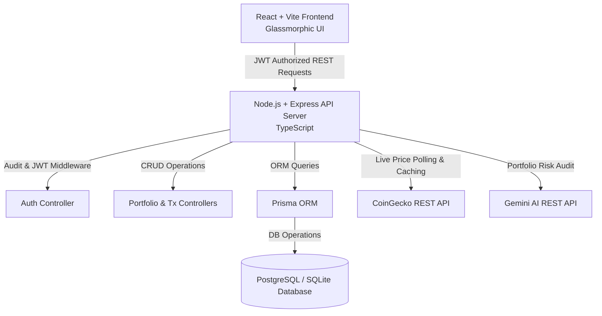

# NexusAnalytics - Financial & Crypto Portfolio Intelligence Platform

[](https://github.com/sqsaay/nexus-analytics/actions)
[](https://opensource.org/licenses/MIT)
[](https://nodejs.org)
[](https://www.postgresql.org)
[](https://react.dev)

**NexusAnalytics** is a production-grade, full-stack financial intelligence and asset tracking suite built to demonstrate enterprise software engineering patterns, clean layered architecture, secure user authentication, robust CRUD operations, live third-party REST API integrations, automated AI risk assessments, and zero-cost cloud deployment workflows.

---

## Key Features & Capabilities

- **Enterprise Authentication & Authorization**:
  - Secure JWT authentication with short-lived access tokens and refresh tokens.
  - Password hashing with `bcryptjs`, Role-Based Access Control (RBAC: `USER` vs `ADMIN`), rate limiting, and security header hardening with `helmet`.

- **Full CRUD Portfolio & Transaction Ledger**:
  - Multi-portfolio management (create, update, switch, and delete portfolios).
  - Transaction ledger allowing users to record `BUY`, `SELL`, and `TRANSFER` operations with custom quantities, execution prices, fees, and timestamps.
  - Automated real-time calculations for **Net Valuation**, **Cost Basis**, **Net P&L ($)**, **ROI (%)**, and **Asset Allocation Breakdown (%)**.

- **Gemini AI Portfolio Risk & Optimization Engine**:
  - Leverages Google's **Gemini AI API** to analyze user holdings, token concentration, and market risk.
  - Generates a **Health Score (0-100)**, **Risk Rating** (Low / Moderate / High / Aggressive), **Diversification Audit**, and **Actionable Rebalancing Advice**.
  - Built-in heuristic fallback engine ensuring 100% functionality even when an AI API key is not configured.

- **Live Market Data Integration**:
  - Integrated with **CoinGecko REST API** for live crypto market pricing, 24-hour gainers/losers, volume, and 7-day historical OHLC price charts.
  - Server-side in-memory caching mechanism to prevent API rate-limiting and maximize responsiveness.

- **Dynamic Visual Analytics**:
  - Interactive **Recharts** charts including Area valuation curves and Donut asset allocation graphs.
  - Modern Glassmorphic dark UI built with pure CSS and styled component patterns.

- **DevOps & Containerization**:
  - Single-command orchestration via `docker-compose.yml` for PostgreSQL database, Express API server, and Nginx React frontend.
  - Automated **GitHub Actions CI/CD** pipeline (`.github/workflows/ci.yml`) validating builds, Prisma schemas, and unit tests.
  - Served OpenAPI / Swagger documentation at `/api-docs`.

---

## System Architecture & Data Flow



---

## Technology Stack

| Layer | Technologies Used |
| :--- | :--- |
| **Frontend** | React 18, Vite, TypeScript, Recharts, Lucide Icons, Axios, React Router v6, Glassmorphic CSS |
| **Backend** | Node.js, Express, TypeScript, Zod Validation, JWT, BcryptJS, Helmet, Express Rate Limit |
| **Database & ORM** | PostgreSQL / SQLite, Prisma ORM (Migrations, Models, Seeders) |
| **Integrations** | CoinGecko REST API (Market Data), Gemini AI REST API (Risk Copilot) |
| **DevOps & QA** | Docker, Docker Compose, Nginx, GitHub Actions (CI/CD), Vitest, Supertest, Swagger UI |

---

## API Endpoint Specifications

### Authentication (`/api/auth`)
- `POST /api/auth/register` - Create a new user account & default portfolio.
- `POST /api/auth/login` - Authenticate credentials & return JWT access/refresh tokens.
- `POST /api/auth/refresh` - Request a new access token using a refresh token.
- `GET /api/auth/me` - Fetch authenticated user profile details *(Requires Bearer Token)*.

### Portfolio Management (`/api/portfolios`)
- `GET /api/portfolios` - Fetch all user portfolios with calculated P&L summaries.
- `POST /api/portfolios` - Create a new portfolio entity.
- `GET /api/portfolios/:id` - Fetch single portfolio details & transaction ledger.
- `PUT /api/portfolios/:id` - Update portfolio metadata.
- `DELETE /api/portfolios/:id` - Remove portfolio and cascaded transactions.

### Transactions CRUD (`/api/transactions`)
- `GET /api/transactions/portfolio/:portfolioId` - Fetch transaction ledger.
- `POST /api/transactions/portfolio/:portfolioId` - Record a `BUY`, `SELL`, or `TRANSFER` transaction.
- `DELETE /api/transactions/:id` - Remove a transaction entry.

### AI Financial Copilot (`/api/analytics`)
- `GET /api/analytics/portfolio/:portfolioId/ai-insights` - Trigger AI portfolio risk & diversification audit.

### Market Data (`/api/market`)
- `GET /api/market/coins` - Fetch top cryptocurrencies with live prices.
- `GET /api/market/coins/:id/history` - Fetch 7-day historical prices for charting.

> **Interactive Swagger OpenAPI Documentation** is available when running the server at `http://localhost:5000/api-docs`.

---

## Quick Start (100% Free & Zero-Setup Local Execution)

### Prerequisites
- **Node.js**: `v18.0.0` or higher installed
- **npm**: `v9.0.0` or higher installed

### 1. Clone & Install Dependencies
```bash
git clone https://github.com/sqsaay/nexus-analytics.git
cd nexus-analytics

# Install root, backend, and frontend dependencies in one command
npm run setup
```

### 2. Database Setup (Zero-Config SQLite)
By default, the backend uses zero-setup local SQLite storage (`dev.db`). Initialize the database and load pre-populated demo data:
```bash
cd backend
npm run db:push
npm run db:seed
```

### 3. Run Development Servers
Return to the project root directory and start both backend and frontend concurrently:
```bash
npm run dev
```

- **Frontend Application**: `http://localhost:3000`
- **Backend API Server**: `http://localhost:5000`
- **Swagger Documentation**: `http://localhost:5000/api-docs`

---

## Pre-Configured Demo Credentials

For instant technical evaluation, click **"Launch Instant Demo Account"** on the login page or use:

- **Email**: `demo@nexus.io`
- **Password**: `Password123!`

---

## Running Automated Tests

Run backend unit and integration tests using Vitest and Supertest:
```bash
npm run test
```

---

## Docker Deployment

Run the complete containerized stack (PostgreSQL + Node Backend + React Nginx Frontend) with a single command:
```bash
docker-compose up --build -d
```

---

## Free Cloud Deployment (GitHub Pages + Render)

### 1. Host Backend on Render ($0 Free Web Service)
1. Push your repository to GitHub.
2. Sign in to **[Render.com](https://render.com)** (100% free, no credit card required).
3. Click **New +** -> **Web Service** and connect your GitHub repository.
4. Set **Root Directory** to `backend`.
5. Set **Build Command** to `npm install && npm run build` and **Start Command** to `npm start`.
6. Copy your live Render service URL (e.g. `https://nexus-api.onrender.com`).

### 2. Deploy Frontend to GitHub Pages ($0 Free Hosting)
- **Automatic Deployment (Recommended)**:
  Push your code to the `main` branch on GitHub. The included GitHub Actions workflow (`.github/workflows/ci.yml`) will automatically build and publish your React site to **GitHub Pages**!

- **Manual Deployment via Terminal**:
  Inside the `frontend` folder, run:
  ```bash
  cd frontend
  npm run deploy
  ```

- **Connecting Frontend to Live Render Backend**:
  In GitHub Repository -> **Settings** -> **Pages**, ensure source is set to `gh-pages` branch.
  Add an environment variable `VITE_API_URL=https://nexus-api.onrender.com/api` in your build settings or GitHub Action.

---

## License
Distributed under the **MIT License**. See `LICENSE` for details.
